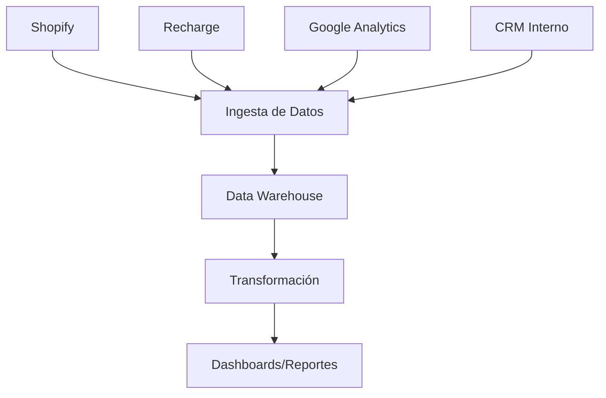

# Data-PetsTable
Plataforma integral de gestión de datos para Pets Table, diseñada para consolidar, analizar y optimizar operaciones de negocio. Nuestro sistema integra múltiples fuentes de datos como Shopify, Recharge y Google Analytics para proporcionar insights estratégicos y impulsar decisiones data-driven.
# 🐶 Pets Table Data Architecture

## Descripción del Proyecto
Sistema de integración de datos para las plataformas de ventas de Pets Table, consolidando información desde múltiples fuentes para optimizar operaciones y análisis.

## 🌐 Fuentes de Datos
- Shopify (Ventas)
- Recharge (Suscripciones)
- Google Analytics (Tráfico web)
- CRM Interno (TBD)
- Plataforma de Inventario (Logistica TBD)

## 📦 Arquitectura de Datos

### Componentes Principales
- **Ingesta de Datos**: Pipelines ELT (Stitch)
- **Almacenamiento**: Base de datos centralizada (TBD)
- **Procesamiento**: Transformaciones y limpieza
- **Visualización**: Dashboards de business intelligence (TBD)

### Diagrama de Flujo


## 🔧 Tecnologías
- **Orquestación**: Stich/Apache Airflow (TBD)
- **Base de Datos**: Big Query (Snowflake TBD)
- **ETL**: Stitch (Apache Spark/Iceberg TBD)
- **Visualización**: Looker/PowerBI (TBD)

## 🧠 Análisis y Ciencia de Datos

### Líneas de Investigación
1. **Predicción de Ventas**
   - Modelos de Machine Learning para forecasting
   - Análisis de series temporales
   - Predicción de demanda de productos

2. **Segmentación de Clientes**
   - Clustering con K-means
   - Análisis de comportamiento de compra
   - Identificación de patrones de consumo

3. **Optimización de Inventario**
   - Modelos predictivos de stock
   - Análisis de rotación de productos
   - Recomendaciones de compra

4. **Análisis de Suscripciones**
   - Predicción de churn
   - Valor lifetime del cliente
   - Estrategias de retención

### Herramientas de Análisis
- Jupyter Notebooks
- Python (Pandas, NumPy)
- Scikit-learn
- TensorFlow
- Apache Spark MLlib (TBD)

### Repositorios de Análisis
- `/notebooks`: Análisis exploratorios
- `/models`: Modelos de Machine Learning
- `/utils`: Funciones de preprocesamiento
- `/reports`: Informes y visualizaciones

### Ejemplo de Notebook
```python
# Predicción de ventas con Machine Learning
import pandas as pd
import numpy as np
from sklearn.model_selection import train_test_split
from sklearn.ensemble import RandomForestRegressor

# Carga de datos
ventas = pd.read_csv('ventas_historicas.csv')

# Preparación de features
X = ventas[['mes', 'producto', 'precio']]
y = ventas['cantidad_vendida']

# Entrenamiento de modelo
X_train, X_test, y_train, y_test = train_test_split(X, y)
modelo = RandomForestRegressor()
modelo.fit(X_train, y_train)
```

## 🔒 Consideraciones de Seguridad
- Encriptación de datos sensibles
- Acceso restringido por roles
- Auditorías periódicas de seguridad

## 🚀 Configuración

### Requisitos Previos
- Python 3.9+
- Docker
- Credenciales de APIs

### Instalación
```bash
cd pets-table-data
git git@github.com:Sebastian-PetsTable/Data-PetsTable.git
pip install -r requirements.txt
```

## 📊 Módulos Principales
1. **Shopify Connector**
   - Extracción de órdenes
   - Sincronización de productos
   - Análisis de ventas

2. **Recharge Integration**
   - Gestión de suscripciones
   - Análisis de recurrencia
   - Predicción de renovaciones

3. **Analytics Pipeline**
   - Consolidación de métricas
   - Generación de reportes
   - Alertas de rendimiento

## 🤝 Contribuciones
- Revisar `CONTRIBUTING.md`
- Pull requests con descripción detallada
- Seguir estándares de código definidos

## 📜 Licencia
Licencia Privada - MIT Licence

## 📞 Contacto
- Data Engineering Team
- sebastian.merino@petstable.mx
